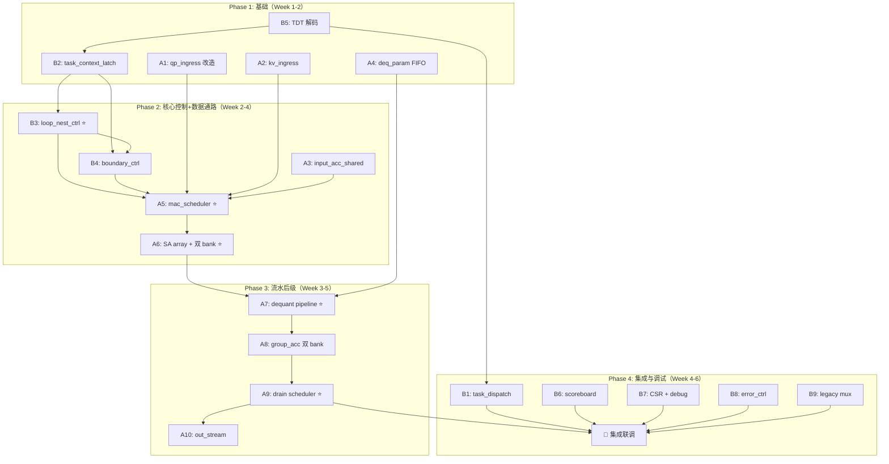

# V0.3 Task Engine — RTL 实现分工计划（7:3 分工）

> 基于 [microarchitecture_v03_task_engine_zh.md](file:///e:/Lorenzo/output/microarchitecture_v03_task_engine_zh.md) 和 [microinstruction_isa_v03_task_engine_zh.md](file:///e:/Lorenzo/output/microinstruction_isa_v03_task_engine_zh.md)

---

## 1. 总体分工策略

| 角色 | 占比 | 定位 | 核心职责 |
|------|------|------|----------|
| **甲方（A）** | **70%** | 数据通路 + 流水主体 | MAC scheduler、SA array 改造、dequant pipeline/token queue、drain scheduler、双 bank 扩展、ingress/output 缓冲、shared input ACC、output ACC |
| **乙方（B）** | **30%** | 控制面 + 配置/调试 | Task engine FSM、loop nest controller、boundary controller、TDT 解码、scoreboard、CSR 扩展、error controller、legacy 兼容 mux |

> [!IMPORTANT]
> 分工边界原则：**甲方拥有所有 datapath RTL 和 FIFO/queue 实例**，**乙方拥有所有 task-level 控制 FSM 和配置寄存器**。两者通过明确定义的 token/credit 接口和 boundary event 信号交互。

---

## 2. 工作项拆分

### 甲方（A）— 数据通路 + 流水主体（70%）

#### A1. `u_qp_ingress` 改造 — Q line buffer + P FIFO
- **对应 spec**：微架构 §3.3, §3.6
- **内容**：
  - Q ping-pong 从 tile-READY 改为 **line-valid** 粒度（每个 bank 维护 `line_valid[d]` bitmap / credit counter）
  - QK mode：`qp_in` 写入第 `d` 个 dim token 后 `q_line_valid[d]=1`，MAC 只需当前 `d` valid
  - PV mode：P FIFO 保持顺序接收
  - 状态机：`FREE → FILLING`（可被 MAC 细粒度读取）`→ FREE`
  - 支持 TDT `q_buffer_policy`：line-valid / tile-ready 两种模式
- **工作量**：中

#### A2. `u_kv_ingress` — K/V FIFO
- **对应 spec**：微架构 §3.3
- **内容**：
  - 复用 V0.2 K/V FIFO，按需加深
  - QK mode 为 K FIFO，PV mode 为 V FIFO
  - ready/valid 接口
- **工作量**：小

#### A3. `u_input_acc_shared` — 共享输入乘加累加器
- **对应 spec**：微架构 §3.5；ISA §4.4
- **内容**：
  - 从 V0.2 纯前缀加法升级为 **乘加型**：`acc_next = acc_prev + cast_fp16(raw_qp * input_factor_fp8)`
  - QK mode：每个 active SA 1 个 input mulacc，生成 Q_ACC line
  - PV mode：启用 `Hp_parallel` 个 input mulacc，维护 P_ACC lane
  - `head_tile_start` 清零
  - `qp_fire = qp_valid && input_factor_valid && qp_ready && input_factor_ready`
  - 与 `input_factor_in` 锁步
- **工作量**：中

#### A4. `u_deq_param_ingress` — 反量化参数 FIFO
- **对应 spec**：微架构 §3.3；ISA §5
- **内容**：
  - 外部 `deq_in` → `{w0_fp16, w1_fp16}` FIFO
  - 深度可配（默认 2-4），TDT `deq_prefill_hint` 指导预填
  - `group_done` 时从 FIFO 头部取出
- **工作量**：小

#### A5. `u_mac_scheduler` — MAC 调度器
- **对应 spec**：微架构 §4
- **内容**：
  - QK：`mac_fire = q_token_valid && k_fifo_valid && partial_acc_bank_ready && sa_ready`
  - PV：`mac_fire = p_fifo_valid && v_fifo_valid && partial_acc_bank_ready && sa_ready`
  - scalar broadcast + vector lane routing
  - 驱动 `u_input_acc_shared` 的 `input_mulacc_fire`
  - 与 loop nest controller 的 `inner_ctr/group_ctr` 交互（接收 boundary event 的 consumer）
- **工作量**：大

#### A6. `u_sa_array[0:3]` — SA 改造 + 双 partial_acc bank
- **对应 spec**：微架构 §4.1
- **内容**：
  - 4 × 1×32 output-stationary SA 复用
  - PE 本地 partial_acc 扩展为 **双 bank**：`bank_mac` / `bank_deq`
  - group boundary 时 emit `deq_token` 并 swap bank
  - 若 `bank_deq` 未释放，MAC 停顿
- **工作量**：大

#### A7. `u_dequant_pipeline` + dequant token queue
- **对应 spec**：微架构 §5.1, §5.2
- **内容**：
  - `partial_acc_bank → u_dequant → dequant_result → group_acc_bank`
  - dequant token queue 深度 2-4
  - token 结构：`{mode, head_tile_id, context_id, group_id, partial_acc_bank_id, group_acc_bank_id, last_group, last_ctx, last_head}`
  - dequant 可多拍，与下一 group MAC 并行
  - 从 deq FIFO 顺序消费 `{w0, w1}`
  - `group_acc += dequant_result` 后释放 partial_acc bank
- **工作量**：大

#### A8. `u_group_acc` — 双 bank group accumulator
- **对应 spec**：微架构 §5.3
- **内容**：
  - 扩展为双 bank：`group_acc_compute_bank` / `group_acc_drain_bank`
  - QK `row_done` 或 PV `head_tile_done` 时 emit `drain_token` 并 swap
  - 若 drain bank 未释放，反压 dequant/MAC
- **工作量**：中

#### A9. `u_drain_scheduler` + output ACC + output queue
- **对应 spec**：微架构 §6
- **内容**：
  - 独立于 SA engine（V0.2 的 DRAIN 占用 SA 的问题彻底解决）
  - drain token 结构：`{mode, head_tile_id, context_id, group_acc_bank_id, valid_len[sa], use_output_lorenzo[sa], output_mode}`
  - output ACC 升级为**乘加型**：`output_acc_next = output_acc_prev + cast_fp16(raw_output * output_factor_fp8)`
  - 每个 active SA 1 个 output mulacc，沿 `drain_lane_ctr=0..31` 分时复用
  - output queue 深度 2-8
  - `group_acc_drain_bank → output_acc → output_queue → softmax/O`
- **工作量**：大

#### A10. `u_out_stream` — 输出流接口
- **对应 spec**：微架构 §3.2；ISA §4.3
- **内容**：
  - QK：A/softmax output
  - PV：O/optional SRAM_QP
  - ready/valid 接口
- **工作量**：小

---

### 乙方（B）— 控制面 + 配置/调试（30%）

#### B1. `u_task_dispatch` — 任务派发器
- **对应 spec**：ISA §2.1, §2.2, §2.3
- **内容**：
  - 解码 `TASK_START`（0x11）、`TASK_WAIT`（0x12）、`TASK_STOP`（0x13）、`TASK_STATUS_SNAPSHOT`（0x14）
  - `TASK_START`：检查 task engine busy，fetch TDT，检查合法性，锁存 task context，启动 engine
  - `TASK_WAIT`：轮询 `task_done[task_id]`，stall sequencer
  - `TASK_STOP`：在 group boundary 停止
  - `wait_on_launch` 逻辑
- **工作量**：中

#### B2. `u_task_context_latch` — 任务上下文锁存
- **对应 spec**：微架构 §2.1
- **内容**：
  - `TASK_START` 后一次性锁存 TDT entry + PE desc + flags
  - 锁存 Host 配置好的循环常量：
    - `qk_dim_group_count = dim/32`
    - `qk_context_block_count = ceil(context_length/32)`
    - `qk_context_tail_mask[31:0]`
    - `pv_context_group_count = ceil(context_length/32)`
    - `pv_last_inner_count`，最后一个 PV context group 的有效 inner 数，1..32
  - PV mapping 常量：`pv_sa_per_head = head_dim/32`、`pv_head_parallel = PE_NUMBER/head_dim`
  - Lorenzo 选择位生成：`use_input_lorenzo[sa]`、`use_output_lorenzo[sa]`
  - 锁存后 active task 不再读 host 可写 descriptor
- **工作量**：中

#### B3. `u_loop_nest_ctrl` — 循环嵌套控制器
- **对应 spec**：微架构 §2.2
- **内容**：
  - 硬件维护 5 个计数器：`head_ctr`、`context_ctr`、`group_ctr`、`inner_ctr`、`drain_lane_ctr`
  - **关键设计约束**：不做多层嵌套 FSM，做 loop-carry controller
    - 每层只含本层 counter + 等值比较 + 1-bit carry/end
    - 跨层组合链只传 1-bit
  - MAC 发射侧只保留 `inner/group` 两层（最高频路径）
  - 循环层级按 mode 区分：
    - QK：`inner -> dim_group -> context_block -> head`
    - PV：`inner -> context_group -> head`
  - QK tail 只由最后一个 `context_block` 的 `qk_context_tail_mask` 处理
  - PV tail 不使用 lane mask，只用 `pv_last_inner_count` 改变最后一个 context group 的 inner 终点
  - `context/head` 由 dequant/group_acc 的 retire 事件推进
  - 预译码 flag：`context_last_q`、`head_last_q` 在 counter 更新时同步刷新
  - 显式禁止形成 `inner→group→context→head→large FSM` 组合链
- **工作量**：大（本模块是乙方最核心工作）

#### B4. `u_boundary_ctrl` — 边界控制器
- **对应 spec**：微架构 §2.3
- **内容**：
  - 从 loop terminal 条件生成 6 个事件：
    - `head_tile_start`：清 input ACC，允许 Q 进入
    - `row_start`：清 group_acc（仅 QK，语义为一个 context block 开始）
    - `group_start`：清 partial_acc bank
    - `group_done`：发 dequant token
    - `row_done`：发 drain A token（仅 QK，token 携带 `lane_valid_mask`）
    - `head_tile_done`：发 drain O token + 切换 head tile（PV）
  - 这些事件全部由硬件触发，不由微码触发
- **工作量**：中

#### B5. TDT 解码 + 合法性检查
- **对应 spec**：ISA §3, §9
- **内容**：
  - 16 × 256-bit TDT RAM
  - 字段解码（desc_type、task_mode、flags、num_heads、context_length、dim、head_dim 等）
  - 合法性检查：
    - `desc_type == 0xD`
    - `task_mode ∈ {0,1}`
    - `group_size == 32`
    - QK：`dim % 32 == 0`
    - context 配置：`context_length != 0`，context block/group count 非 0，
      `qk_context_tail_mask != 0`，`pv_last_inner_count ∈ 1..32`
    - PV mapping：`head_dim>=32`, `head_dim%32==0`, `Hp_parallel*head_dim==128`, `SA_per_head*32==head_dim`
  - 错误码生成
- **工作量**：中

#### B6. `u_task_scoreboard` — 任务记分板
- **对应 spec**：微架构 §10
- **内容**：
  - task 级：`task_busy[15:0]`、`task_done[15:0]`、`task_error[15:0]`、`task_error_code[15:0][7:0]`
  - pipeline 级：`stream_credit_q/k/p/v`、`deq_fifo_level`、`partial_acc_bank_free[2]`、`group_acc_bank_free[2]`、`deq_token_queue_level`、`drain_token_queue_level`、`output_queue_level`
  - `TASK_WAIT` 只看 `task_done/error`
  - pipeline scoreboard 不暴露给微码，通过 CSR debug 读取
- **工作量**：小

#### B7. CSR 扩展 + `u_debug_snapshot`
- **对应 spec**：微架构 §11；ISA §2.4
- **内容**：
  - 新增 CSR：`csr_task_busy/done/error/error_code`、counter snapshots、FIFO levels
  - `TASK_STATUS_SNAPSHOT` 指令触发 counter snapshot 到 CSR
  - debug 读取接口
- **工作量**：小

#### B8. `u_error_ctrl` — 错误控制器
- **对应 spec**：ISA §9
- **内容**：
  - 错误码枚举：`ILLEGAL_TASK_DESC`、`ILLEGAL_TASK_MODE`、`TASK_ENGINE_BUSY`、`ILLEGAL_GROUP_SIZE`、`ILLEGAL_DIM`、`ILLEGAL_CONTEXT`、`ILLEGAL_PV_MAP`、`ILLEGAL_STREAM_CONTRACT`、`TASK_BACKPRESSURE_DEBUG`
  - 错误时 HALT 或写 `task_error`
- **工作量**：小

#### B9. Legacy 兼容 Mux
- **对应 spec**：微架构 §12
- **内容**：
  - Task mode / Legacy mode 切换 mux
  - Legacy mode 保留 `u_loop_ctrl`、`u_cmd_dispatch`
  - 共享 datapath 资源的模式选择
- **工作量**：小

---

## 3. 工作量估算汇总

### 甲方（A）— 70%

| 编号 | 模块 | 工作量 | 估算占比 |
|------|------|--------|----------|
| A1 | `u_qp_ingress` 改造 | 中 | 7% |
| A2 | `u_kv_ingress` | 小 | 3% |
| A3 | `u_input_acc_shared` | 中 | 8% |
| A4 | `u_deq_param_ingress` | 小 | 3% |
| A5 | `u_mac_scheduler` | 大 | 12% |
| A6 | `u_sa_array` + 双 partial_acc bank | 大 | 12% |
| A7 | `u_dequant_pipeline` + token queue | 大 | 10% |
| A8 | `u_group_acc` 双 bank | 中 | 5% |
| A9 | `u_drain_scheduler` + output ACC + output queue | 大 | 8% |
| A10 | `u_out_stream` | 小 | 2% |
| | **甲方合计** | | **70%** |

### 乙方（B）— 30%

| 编号 | 模块 | 工作量 | 估算占比 |
|------|------|--------|----------|
| B1 | `u_task_dispatch` | 中 | 5% |
| B2 | `u_task_context_latch` | 中 | 4% |
| B3 | `u_loop_nest_ctrl` | 大 | 8% |
| B4 | `u_boundary_ctrl` | 中 | 5% |
| B5 | TDT 解码 + 合法性检查 | 中 | 3% |
| B6 | `u_task_scoreboard` | 小 | 2% |
| B7 | CSR 扩展 + debug snapshot | 小 | 1% |
| B8 | `u_error_ctrl` | 小 | 1% |
| B9 | Legacy 兼容 Mux | 小 | 1% |
| | **乙方合计** | | **30%** |

---

## 4. 甲乙方接口定义

> [!IMPORTANT]
> 以下接口是甲乙双方联调的关键契约，必须在编码前达成一致。

### 4.1 乙方 → 甲方（控制 → 数据通路）

```text
// Loop Nest → MAC Scheduler
output  logic        inner_last_q        // inner_ctr == 31
output  logic        group_last_q        // group_ctr == group_max_minus1
input   logic        mac_fire            // 由甲方 MAC scheduler 产生

// Boundary → Datapath
output  logic        head_tile_start     // 清 input ACC，允许 Q 进入
output  logic        row_start           // 清 group_acc（QK only）
output  logic        group_start         // 清 partial_acc bank
output  logic        group_done          // 发 dequant token
output  logic        row_done            // 发 drain A token（QK only）
output  logic        head_tile_done      // 发 drain O token（PV only）

// Task Context → Datapath
output  task_ctx_t   task_ctx            // 锁存后的 task 参数
output  logic [3:0]  use_input_lorenzo   // per-SA
output  logic [3:0]  use_output_lorenzo  // per-SA
output  logic [1:0]  task_mode           // 0=QK, 1=PV
output  logic [7:0]  active_sa_count

// Deq Token (group_done 时 emit)
output  deq_token_t  deq_token
output  logic        deq_token_valid

// Drain Token (row_done / head_tile_done 时 emit)
output  drain_token_t drain_token
output  logic         drain_token_valid
```

### 4.2 甲方 → 乙方（数据通路 → 控制）

```text
// MAC Scheduler → Loop Nest
output  logic        mac_fire            // MAC 实际发射

// Dequant Pipeline → Loop Nest (retire 事件)
output  logic        deq_token_retire    // dequant + group_acc 完成，释放 token
output  logic        deq_token_last_group
output  logic        deq_token_last_ctx
output  logic        deq_token_last_head

// Scoreboard 信号
output  logic        task_done_pulse     // 整个 task 完成
output  logic [7:0]  task_error_code

// Backpressure 状态（供 scoreboard 采集）
output  logic [3:0]  partial_acc_bank_free
output  logic [1:0]  group_acc_bank_free
output  logic [3:0]  deq_token_queue_level
output  logic [3:0]  drain_token_queue_level
output  logic [3:0]  output_queue_level
output  logic [3:0]  stream_credit_q, stream_credit_k, stream_credit_p, stream_credit_v
```

---

## 5. 依赖关系与里程碑



### 里程碑节点

| 里程碑 | 时间 | 甲方交付 | 乙方交付 |
|--------|------|----------|----------|
| **M1: 接口冻结** | Week 1 | ingress FIFO 接口定义 | TDT 解码 + context latch 接口定义 |
| **M2: 控制面可跑** | Week 2-3 | — | loop_nest_ctrl + boundary_ctrl 单独仿真通过 |
| **M3: 数据通路可跑** | Week 3-4 | MAC→dequant→drain 单路径仿真通过 | — |
| **M4: 初次联调** | Week 4 | 甲方 datapath stub 接入乙方控制 | 乙方控制接入甲方 datapath |
| **M5: QK 单 task 通过** | Week 5 | QK 全流水 steady state | QK task dispatch + wait |
| **M6: PV 单 task 通过** | Week 5-6 | PV 全流水 steady state | PV task dispatch + wait |
| **M7: 完整回归** | Week 6 | QK→PV 联合 testbench | legacy mux + error + debug |

---

## 6. Open Questions

> [!IMPORTANT]
> 1. **甲乙方具体对应谁？** 请确认 70% 方和 30% 方分别对应哪位工程师或团队。

> [!IMPORTANT]
> 2. **最小 V0.3 还是高吞吐 V0.3？** 微架构 §13 提供了两个实现级别。初始目标是最小 V0.3（dequant token queue 深度 1、output queue 深度 2）还是直接做高吞吐版本？这会影响 A7/A8/A9 的工作量。

> [!NOTE]
> 3. **PV lane 映射的验证策略**：PV 的 `flat_lane → hp_id/dim_id` 映射逻辑跨甲乙双方。建议在 M1 阶段就写一个参考模型。

> [!NOTE]
> 4. **Legacy mode 测试优先级**：B9 legacy mux 依赖 V0.2 已有 RTL。如果 V0.2 RTL 已稳定，B9 可推迟到 Phase 4；如果需要并行维护，需提前规划。

---

## Verification Plan

### Automated Tests

- **Phase 2 单元测试**：每个模块独立 testbench，使用 SystemVerilog assertion 覆盖边界条件
  - `u_loop_nest_ctrl`：验证 counter rollover、carry propagation、禁止长组合链
  - `u_mac_scheduler`：验证 `mac_fire` 条件、backpressure 行为
  - `u_sa_array`：验证双 bank swap 和停顿条件
- **Phase 3 流水测试**：MAC → dequant → group_acc → drain 全流水 waveform 验证
- **Phase 4 集成回归**：
  ```
  make sim TARGET=tb_task_engine_qk_single
  make sim TARGET=tb_task_engine_pv_single
  make sim TARGET=tb_task_engine_qk_pv_sequence
  make sim TARGET=tb_task_engine_backpressure
  make sim TARGET=tb_task_engine_legacy_compat
  ```

### Manual Verification

- Waveform 检查 steady state 流水图（对照微架构 §7, §8 的理想时序）
- Backpressure 场景注入：逐项验证 §9 的 8 种停顿来源
- 错误注入：验证 §9 的全部 9 种错误码
